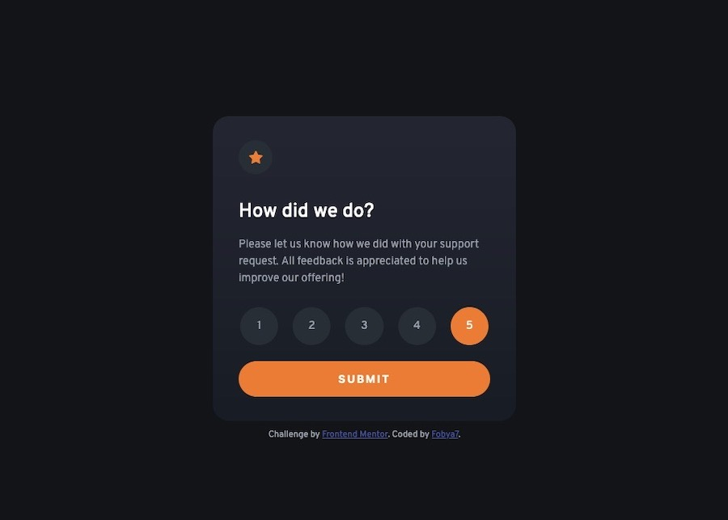
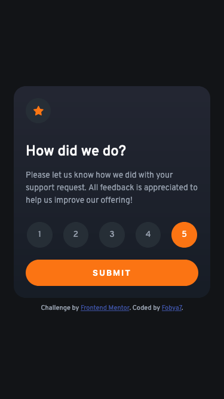

# Interactive two-state rating component solution using JavaScript and content replacement

This is a solution to the [Interactive rating component challenge on Frontend Mentor](https://www.frontendmentor.io/challenges/interactive-rating-component-koxpeBUmI). For more designs - check out [my profile](https://www.frontendmentor.io/profile/Fobya7) there!


## Overview

### The challenge

Users should be able to:

- View the optimal layout for the app depending on their device's screen size
- See hover states for all interactive elements on the page
- Select and submit a number rating
- See the "Thank you" card state after submitting a rating

### The solution

Live Site URL: [Check out this solution live!]()

| Desktop rating state |
| :---: |
|  |

| Desktop thank you state |
| :---: |
|  |

| Mobile rating state | Mobile thank you state |
| :---: | :---: |
|  |  |


## My process

### Built with

- Semantic HTML5 markup
- CSS custom properties
- Flexbox
- Mobile-first workflow
- JavaScript

### What I learned

- This was my first time using JavaScript, so most of my knowleage comes from MDMs [JavaScript basics](https://developer.mozilla.org/en-US/docs/Learn/Getting_started_with_the_web/JavaScript_basics).
<br>
I'm pretty proud of this part: (I've modified the assigned design a little bit. Submit button is disabled untill user picks a rating, so they cannot submit an empty value. )
```js
// starting off with submit button disabled
document.getElementById("rate-us-rating-submit").disabled = true
document.getElementsByName("rate-us-options").forEach( element =>
{
    element.onclick = ()=>
    {
        // enabling the submit button after a click on any of the rating buttons
        document.getElementById("rate-us-rating-submit").disabled = false
    }
} )
```

- I implemented radio buttons and gave then a custom style thanks to [this tutorial](https://www.w3schools.com/howto/howto_css_custom_checkbox.asp).

- I know where to put the [script element](https://developer.mozilla.org/en-US/docs/Learn/JavaScript/First_steps/What_is_JavaScript#script_loading_strategies), and why it's customary to put it at the bottom of the website's body.

- You can [replace content of a div](https://stackoverflow.com/questions/37347690/how-to-replace-div-with-another-div-in-javascript) or make it invisible.

- And also this neat line-saving trick with margins: (It makes it so all the margins are 0px, except the top one, which is 20px.)
```css
.class-name
{
    margin: 0px;
    margin-top: 20px;
}
```

### Continued development

- I really need to learned JavaScript. I mean, what I coded does work, but I don't want to stop at that. I checked out [this website](https://techbootcamps.utexas.edu/blog/best-ways-to-learn-javascript/) with a pretty neat list of learning resources.
